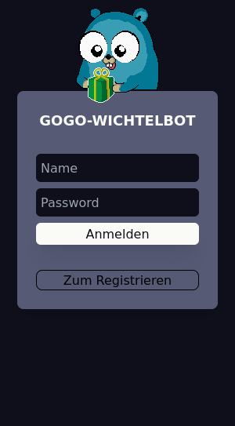
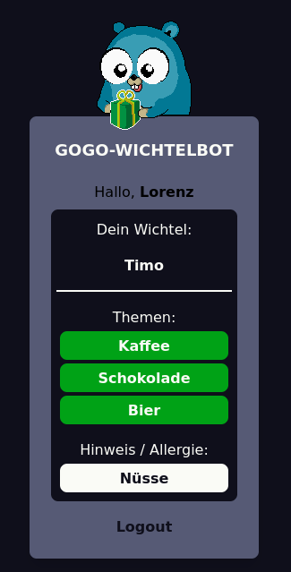

# Go Wichtelbot App
web app for randomly assigning gifting partners. I wrote this for family events like Christmas. Frontend is in german.

Used Stack:
- Backend: <strong>GO + GIN-Framework</strong>
- Frontend: <strong>SolidJs + Tailwind</strong>

To prevent (myself from) result peeking, data is stored in a Base64 encoded JSON instead of a Database.

## How does it play?
People register, listing some themes and allergies.

Then the admin triggers the dice roll using a admin API. This action requires a valid admin token.

```
#reset
GET (URL)/reset
Content-Type: application/json
Authorization: superdupersupersecrettoken

#play
GET (URL)/play
Content-Type: application/json
Authorization: superdupersupersecrettoken
```

## Screenshots

<div style="float:left">


</div>


The gopher is drawn by myself. Anything in this repo is free to use/modify. Will probably be reused next year. Might even get some upgrades.
